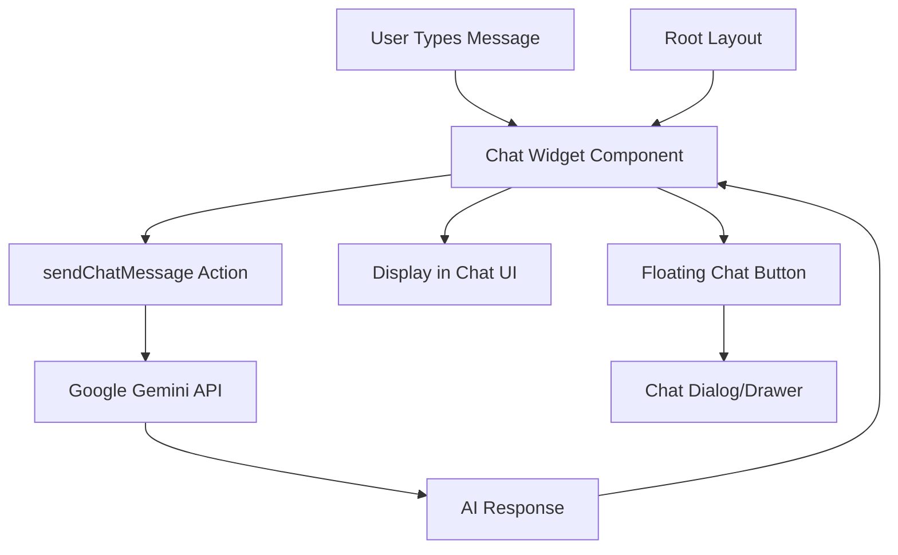
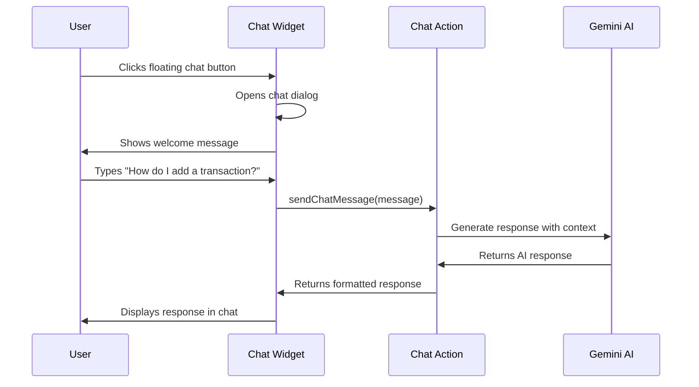

# AI Chatbot Integration Plan

## Overview

Implement a floating chat widget (bottom-right corner) using Google Gemini AI to provide financial guidance, answer user questions about the platform, and explain features.

## Architecture



## Implementation Steps

### 1. Create Chat Server Action

**File**: `actions/chat.js` (new file)

Create a server action to handle chat messages:

- Initialize Gemini API (similar to [actions/transaction.js](actions/transaction.js) line 10)
- Create system prompt for financial assistant context
- Handle streaming responses for better UX
- Add rate limiting using ArcJet (like transaction actions)
- Return AI responses with proper error handling

Key features:

```javascript
// System prompt context
const SYSTEM_PROMPT = `You are a helpful financial assistant for Welth, 
an AI-powered finance management platform. Help users with:
- General financial advice and tips
- Budgeting strategies
- Explaining platform features
- Answering finance-related questions
Keep responses concise, friendly, and actionable.`;
```

### 2. Create Chat Widget Component

**File**: `components/ai-chat-widget.jsx` (new file)

Build a floating chat widget with:

- **Closed state**: Floating button (bottom-right, fixed position)
- **Open state**: Chat dialog (400px width, 600px height)
- Message history display with scrolling
- Input field with send button
- Loading states (typing indicator)
- Smooth animations (slide up/fade)
- Mobile responsive design

UI Components needed (from shadcn):

- Button (chat icon, send button)
- Card/Dialog (chat container)
- Input (message field)
- ScrollArea (message history)
- Badge (to show "AI" or "online" status)

### 3. Add to Root Layout

**File**: [app/layout.js](app/layout.js)

Add the chat widget to root layout (after Toaster, before closing body tag):

```jsx
<body className={`${inter.className}`}>
  <Header />
  <main className="min-h-screen">{children}</main>
  <Toaster richColors />
  <AIChatWidget /> {/* Add here */}
  <footer>...</footer>
</body>
```

### 4. Message History Management

**Approach**: Client-side state (useState)

- Store conversation in component state
- Each message: `{ role: 'user' | 'assistant', content: string, timestamp: Date }`
- Clear conversation button
- Optional: Persist to localStorage for session continuity

### 5. Styling & Animations

Match existing theme:

- Use Tailwind classes consistent with the app
- Blue accent colors (matching platform theme)
- Smooth transitions (transform, opacity)
- Loading states with spinner
- Typing indicator animation (3 dots)

### 6. Features to Include

1. **Welcome Message**: Automatic greeting when opened first time
2. **Suggested Prompts**: Quick buttons for common questions

   - "How do I create a budget?"
   - "Explain recurring transactions"
   - "Tips for saving money"

3. **Error Handling**: Graceful error messages
4. **Rate Limiting**: Prevent abuse (using ArcJet)
5. **Accessibility**: Keyboard navigation, ARIA labels

## File Structure

```
New Files:
├── actions/chat.js                    (Server action)
└── components/ai-chat-widget.jsx      (Chat UI component)

Modified Files:
└── app/layout.js                      (Add chat widget)
```

## Key Code References

### Gemini API Pattern

Follow the pattern from [actions/transaction.js](actions/transaction.js) lines 6-10, 233:

```javascript
import { GoogleGenerativeAI } from "@google/generative-ai";
const genAI = new GoogleGenerativeAI(process.env.GEMINI_API_KEY);
const model = genAI.getGenerativeModel({ model: "gemini-1.5-flash" });
```

### ArcJet Rate Limiting

Follow pattern from [actions/transaction.js](actions/transaction.js) lines 7-8, 24-47 for rate limiting

### Layout Structure

Add component in [app/layout.js](app/layout.js) at line 24 (after Toaster)

## Expected User Flow



## Benefits for Your Project

1. **Enhanced UX**: Users get instant help without leaving the page
2. **AI Integration**: Showcases advanced AI capabilities beyond receipt scanning
3. **User Engagement**: Interactive feature keeps users engaged
4. **Reduced Support**: AI answers common questions automatically
5. **Modern Feature**: Adds cutting-edge technology to your platform

## Estimated Complexity

- **Time**: 2-3 hours of development
- **Files**: 2 new files, 1 modification
- **Dependencies**: No new packages needed (Gemini already configured)
- **Testing**: Simple - test chat flow, error cases, rate limits

## Future Enhancements (Optional)

- Voice input/output
- Chat history in database
- Multi-language support
- Integration with user's transaction data for personalized advice
- Conversation analytics

Ready to implement when you approve!